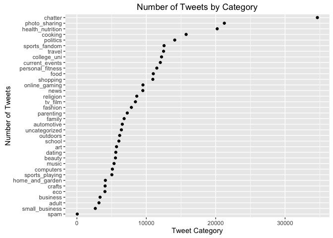

I. Probability Practice
-----------------------

### Part A

To start, the abbreviations that will be used in the solution are
listed.

-   Two categories of users: Truthful Clicker (*TC*) and Random Clicker
    (*RC*)
-   Two outcomes: User answers "Yes" (*Y*) and User answers "No" (*N*)

We are given the following information:

-   *P*(*Y*) = 0.65 and *P*(*N*) = 0.35
-   *P*(*RC*) = 0.3 and *P*(*TC*) = 0.7
-   *P*(*Y* | *RC*) = 0.5

The question is asking for:

> *P*(*Y* | *TC*) = ?

Calculating *P*(*Y* | *TC*) involves using the *law of total
probability*. Substituting the given information allows us to write the
following:

> *P*(*Y*) = *P*(*Y* | *TC*) × *P*(*TC*) + *P*(*Y* | *RC*) × *P*(*RC*)

Next, we substitute the values into the equation.

> 0.65 = *P*(*Y* | *TC*) × 0.7 + (0.5 × 0.3)

Finally, we solve for *P*(*Y* | *TC*).

> 0.65 = *P*(*Y* | *TC*) × 0.7 + 0.15 0.5 = *P*(*Y* | *TC*) × 0.7 0.71 =
> *P*(*Y* | *TC*)

The fraction of users who clicked "Yes" given that they were Truthful
Clickers is 0.71.

### Part B

We are given the following information:

-   *P*(*Postive* | *Disease*) = 0.993
-   *P*(*Negative* | ~*Disease*) = 0.9999
-   *P*(*Disease*) = 0.000025

Assuming that *P*(*Positive*) and *P*(*Negative*) are mutually exclusive
events, we can also calculate the complement of these events:

-   *P*(*Negative* | *Disease*) = 0.007
-   *P*(*Positive* | ~*Disease*) = 0.0001
-   *P*(~*Disease*) = 0.999975

The question is asking for the following:

> *P*(*Disease* | *Positive*)

The question could also be rewritten using Baye's Rule:

> \[*P*(*Disease*) × *P*(*Postive* | *Disease*) \] / (*P*(*Positive*))

Both components of the numerator are given. To solve for
*P*(*Positive*), the law of total probability can be used.

> *P*(*Positive*) = *P*(*Postive* | *Disease*)**P*(*Disease*) +
> *P*(*Postive* | ~*Disease*)P*(~*Disease*)

> *P*(*Positive*) = (0.993)(.000025) + (0.0001)(.999975)

> *P*(*Positive*) = 0.0001248225

Now this can be plugged into Baye's Rule.

> *P*(*Disease* | *Positive*) = \[*P*(*Disease*) × *P*(*Postive* |
> *Disease*) \] / (*P*(*Positive*))

> *P*(*Disease* | *Positive*) = (0.000025 × 0.993) / 0.0001248225

> *P*(*Disease* | *Positive*) = 0.1989 = 19.89%

Given that someone tested positive for the disease, the chance that he
or she has the disease is nearly 20%. In other words, the test returns
false positives almost 80% of the time. If a universal testing policy
for this disease were to be implemented, four out of 5 people who tested
positive wouldn't actually have the disease; the policy would be
extremely ineffective.

II. Exploratory Analysis: Green Buildings
-----------------------------------------

To determine whether to "go green" for her next real estate investment,
a real estate developer had an on-staff "Excel guru" create a
preliminary recommendation. His recommendation is that the company
should build the "green" building because according to his analysis,
green buildings command a higher rent, and the difference in rent would
be extra revenue that would turn profitable after paying back the extra
investment of "going green" within 9 years, assuming the leasing rate is
90%+.

While this analysis cannot provide a recommendation on whether to build
the green building, it will point out three key fallacies in the guru's
analysis that casts doubt on the causal relationship between "going
green" and average rent. The three fallacies I will focus on are:

-   *Using median price as the sole basis on deciding whether "going
    green"*
-   *Failing to analyze confounding variables that may explain why green
    buildings are pricier*
-   *Using the difference in green and non-green median rents to
    determine profit without subsetting the data*

So whether the developer builds the green building, she can make a more
informed decision after reading the analysis below.

### How much does a higher median rent tell us?

The guru's first claim is that because the median market rent per square
foot per year of a green building is $2.60 more than that of a non-green
building, the difference in rent reflects the increase in value by going
green. To determine whether this difference in median is significant, we
could run a permutation test by shuffling the green status, then
creating a histogram of the median rents of only green buildings. The
histogram below is the result from 1000 resamples. It turns out that
$26.40, the median rent of green buildings that the guru calculated, is
statistically significant at the 95% level.

However, using the median rent as the basis for revenue calculations
could be misleading. After all, there's a 50% chance that the "actual"
median rent that the real estate developer sets for her building is
lower depending on other variables. Maybe no company in Austin would pay
$27.60 per square foot per year, even the building were "green." Maybe
companies in Austin care more about other building features. In other
words, a median, even one that is statistically significant, by itself
doesn't prove the value of going "green". The box plot below shows a
large overlap between the rents of green and non-green buildings.

The large overlap reveals variation in rent whether a building has a
green rating or not. The real estate developer would want to understand
a bit more about the differences between green and non-green buildings
in the data set. So other variables must be analyzed for clues for how
plausible the "green premium" is.

### Possible Confounding Variables: Being "best-in-class" matters

"Class" is a variable that the guru possibly overlooked and that may
explain why the median rent of a green building is higher. It is an
indicator of building quality relative to other buildings in a market.
Is there a relationship between having a green rating and class?

The lattice plot above shows the log of the average rent in a building's
cluster on the x-axis and the log of rent on the y-axis. The average
rent of a building's cluster was chosen to be the x-axis because it
allows us to see the relative value of a building compared to other
buildings in its "price group"; a building that has a higher rent than
another within the same cluster rent must be more valuable due to
factors other than cluster location.

The magenta points are buildings that are Class A. The blue points are
buildings that are either Class B or C. The left plot contains buildings
with no green rating. There are few Class A buildings that lie on bottom
section of the plot. Although there is some overlap between the blue and
magenta points, the rents of Class A buildings appear to be slightly
higher than those of non-Class A buildings. Being class A appears to
have a positive effect on rent, particularly in areas where the average
cluster rent is low.

What's surprising is the right plot, which contains only buildings with
a green rating. Nearly all of the buildings are Class A! Furthermore,
for a given cluster-rent value, the rents of Class A buildings with and
without green ratings are nearly identical. *This suggests that being
Class A may have a larger effect on rent than having a green rating.*

How do the median prices look after controlling for the class of a
building?

<table>
<caption>Median Rent Prices</caption>
<thead>
<tr class="header">
<th align="left"></th>
<th align="right">Class A</th>
<th align="right">~Class A</th>
<th align="left"></th>
</tr>
</thead>
<tbody>
<tr class="odd">
<td align="left">Green</td>
<td align="right">28.44</td>
<td align="right">25.55</td>
<td align="left">27.60</td>
</tr>
<tr class="even">
<td align="left">~Green</td>
<td align="right">28.20</td>
<td align="right">23.43</td>
<td align="left">25.00</td>
</tr>
<tr class="odd">
<td align="left"></td>
<td align="right">28.20</td>
<td align="right">23.50</td>
<td align="left">25.16</td>
</tr>
</tbody>
</table>

According to the median rent table, if a building is Class A, then
having a green rating does not appear to change the median rent. This
confirms what the lattice plot showed. However, the median rents of
non-Class A buildings appear to depend on whether they have green
ratings. It would appear that being green matters if the building is not
Class A, which is plausible. However, is there skew in the data that may
cause the median of non-Class A buildings to mislead us?

### Why Using The Difference in Medians to Calculate Additional Revenue is Misleading

Up until this point, the analysis has ignored the skew in the data and
focused on a confounding variable, Class. Let's assume that the
difference in median prices between green and non-green buildings (i.e.
the "green premium") is still one criteria for determining whether to go
"green." Recall that his other criteria is leasing rate - that the guru
expects the investment from going "green" will be repaid within 8 years
if the leasing rate is also at least 90%. The analysis will now show how
subsetting the data by 3 variables - class, green rating, and leasing
rate - reveals how fickle the median is. By subsetting, we can see the
effects of different variables on the median price, and show that the
"green premium" that the guru calculated is misleading.

The guru used the median rent difference between non-green and green
buildings, $2.60, as his estimate of the increase in marginal revenue
from "going green." He removed buildings with leasing rates below 10% to
remove some outliers in the data.

Let's take a look at how the data is currently distributed. The plot
below shows the distribution of leasing rates for both Class A and
non-Class A buildings.

The guru is justified in removing the buildings with sub-10% leasing
rates. There are a large number of non-Class A buildings with sub-10%
leasing rates and unless the real estate developer expects to have a sub
10% leasing rate for her building, excluding these buildings makes
sense.

Now let's only look at non-Class A buildings and see how leasing rate
affects the "green premium". Recall that the premium is the difference
in median prices of green and non-green buildings. We have already seen
in the previous section that if a building is Class A, being "green" has
little impact on the median price.

For non-class A buildings, at every leasing rate level, the "green
premium" of non-Class A buildings is lower than than what the guru
originally estimated ($2.60, which is colored in blue). What's
surprising is that at higher leasing rates, the "green premium"
disappears and becomes a "green cost"! *As we have discovered, being
Class A certainly matters much more than being green.*

Let's now only look at buildings with 90%+ leasing rates. After all, the
real estate devloper would want to know the rents of comparable
buildings and it can be assumed that she doesn't plan on having a low
leasing rate in her building. Recall that among non-Class A buildings,
the median of green buildings were higher than that of non-green
buildings.

<table>
<caption>Median Rent Prices, Leasing Rate &gt; 90%</caption>
<thead>
<tr class="header">
<th align="left"></th>
<th align="right">Class A</th>
<th align="right">~Class A</th>
<th align="right">Green Rating Median</th>
</tr>
</thead>
<tbody>
<tr class="odd">
<td align="left">Green</td>
<td align="right">29.00</td>
<td align="right">24.36</td>
<td align="right">28.485</td>
</tr>
<tr class="even">
<td align="left">~Green</td>
<td align="right">29.67</td>
<td align="right">26.92</td>
<td align="right">27.275</td>
</tr>
<tr class="odd">
<td align="left">Class Median</td>
<td align="right">29.55</td>
<td align="right">26.64</td>
<td align="right">27.500</td>
</tr>
</tbody>
</table>

As we've seen from the previous line graph, if the building is not class
A, the median rent of green buildings is actually lower than that of
non-green buidings. However, even if the guru had ignored the class of
the building and used the difference in median price between green and
non-green buildings as his estimate for marginal revenue, the difference
in medians among buildings with &gt;90% leasing rates is $1.21, which is
more than half of his original estimate of $2.60. Using the median to
compute the "green premium" is misleading. It is important to understand
the effects of other variables, some of which may inflate the value from
going "green."

### Conclusion

This analysis has shown three fallacies in the guru's analysis and
analyzed whether calculating a "green premium" is as simple as taking
the difference of median rents between green and non-green buildings. It
turns out that looking at the median, even if it's statistically
significant, and not accounting for other variables is misleading. By
introducing other variables such as class and leasing rate and
accounting for some of the skew in the data, we have seen that the
difference of median rents between green and non-green buildings becomes
a less comprehensive metric. There is no substitute for understanding
the impact of all possible variables. Although this analysis cannot
provide a final recommendation on whether to go "green," the real estate
developer should figure out the criteria for being Class A; if being
"green" is highly recommended to become Class A, then investing in a
"green" building might be worth it.

III. Bootstrapping
------------------

### Overview of the 5 ETF's

Let's first take a look at how the adjusted closing price of each ETF
looks from 8/1/2007 to 8/1/2016. I chose this time frame because it
contains periods of both recession and growth.

At first glance, it would appear that the prices of all 5 ETF's
increased over the last 9 years, and spikes or dips in price seem to
occur in similar periods. For example, let's take a look at 2008. The
SPY, LQD, EEM and VNQ graphs all dip in 2008, with the EEM and VNQ
(indexes of emerging markets and real estate, respectively) graphs
showing large dips. On the other hand, the TLT (U.S. Treasury 20 Year
Index) graph shows a rise in this same time period. The magnitude of
dips and spikes, and the correlation of the price movements among the
indexes could be summarized by the *beta*.

### Finding Beta

The plot below shows the returns of all 5 ETF's compared against each
other.

The patterns of these plots confirm some of what we saw from the line
plots earlier, and show the relationship among all the funds. In the
line plots, when we just looked at 2008, there seemed to be a negative
relationship between the indexes of the S&P 500 (SPY) and the U.S.
Treasury 20 Year (TLT); while the S&P 500 dipped, the U.S. Treasury 20
year index increased. Their plot shows a negative relationship.
Furthermore, the EEM and VNQ plots seemed to mirror the SPY plot, but in
a more volatile fashion; both the spikes and dips of these plots were
larger. The plots of EEM and VNQ against the SPY plot have a positive
linear relationship.

Using SPY as the response, the remaining 4 indexes could be used as the
predictors to create a linear regression. The slopes of the resulting
regressions are the *betas*. A beta of 1 means that the returns of the
index are exactly the same as those of the S&P 500. Assets with betas
that are greater than 1 or less than -1 are considered volatile because
returns and losses relative to the S&P 500 are magnified. Assets with
betas closer to 0 have returns that don't follow the S&P 500 as much,
and may be considered safer because returns and losses are reduced. The
betas for the 4 indexes relative to the S%P 500 are below.

<table>
<thead>
<tr class="header">
<th align="left"></th>
<th align="right">Beta</th>
</tr>
</thead>
<tbody>
<tr class="odd">
<td align="left">TLT</td>
<td align="right">-0.333</td>
</tr>
<tr class="even">
<td align="left">LQD</td>
<td align="right">0.045</td>
</tr>
<tr class="odd">
<td align="left">EEM</td>
<td align="right">1.410</td>
</tr>
<tr class="even">
<td align="left">VNQ</td>
<td align="right">1.348</td>
</tr>
</tbody>
</table>

The betas appear to confirm what we saw in the line graphs. The two
indexes with the largest swings, EEM and VNQ, have betas larger than 1.
In the case of EEM, a beta of 1.41 means that the EEM's return will be
1.41 times the S&P 500's return. If the S&P 500 index loses $1,000, then
the EEM will lose $1,400. If the S&P 500 index increases by $1,000, the
EEM will gain $1,400.

On the other hand, TLT has a negative beta, which means that when the
S&P 500 index increases, the TLT index slightly decreases. If the S&P
500 index loses $1,000, the TLT gains $330. We have also seen this
relationship in the plots of the indexes.

### Using the Betas to Determine Portfolio Allocation

Now that we've seen what the betas mean, we can use them as a guide to
allocate stock into our portfolios.

Let's decide how to allocate funds into three types of portfolios: even,
risk, and safe.

-   Even: 20% of funds will be placed into all 5 index types.
-   Risky: To increase returns, a risky portfolio places more weight on
    funds that have betas greater than 1. However, losses will
    be magnified.
-   Safe: To minimize the impact of losses, a safe portfolio places more
    weight on funds that have betas closer to 0.

### Simulating Trading Days For Our 3 Portfolios

For the simulation, a trading period of 20 days will be simulated 3000
times. The portfolios are allocated as follows:

-   Even: 20% to each asset
-   Risky: 40% to both EEM and VNQ; 20% to SPY
-   Safe: 40% to both TLT and LQD; 20% to SPY

<table>
<caption>Summary Statistics - 5000 Simulations of 20 Trading Days</caption>
<thead>
<tr class="header">
<th align="left"></th>
<th align="right">VAR (5%)</th>
<th align="right">Mean</th>
<th align="right">SD</th>
<th align="right">-2.5%</th>
<th align="right">97.5%</th>
</tr>
</thead>
<tbody>
<tr class="odd">
<td align="left">Even</td>
<td align="right">-6627.36</td>
<td align="right">784.976</td>
<td align="right">4849.779</td>
<td align="right">-8263.794</td>
<td align="right">11081.044</td>
</tr>
<tr class="even">
<td align="left">Risky</td>
<td align="right">-12523.35</td>
<td align="right">847.798</td>
<td align="right">8544.046</td>
<td align="right">-14446.490</td>
<td align="right">19488.576</td>
</tr>
<tr class="odd">
<td align="left">Safe</td>
<td align="right">-3195.49</td>
<td align="right">670.357</td>
<td align="right">2376.434</td>
<td align="right">-4041.880</td>
<td align="right">5381.275</td>
</tr>
</tbody>
</table>

Let's take a look at the results from our simulation.

-   VAR (5%) - Value-at-risk at the 5% level
-   Mean, SD, and 95% confidence interval show profits (Ending portfolio
    balance - $100,000 initial investment)

The results show that the riskier the portfolio is, the more volatile it
is. The Risky portfolio has a higher value-at-risk (5%) and standard
deviation, and has a wider 95% connfidence interval than the Safe and
Even portfolios. It also has a higher mean. On the opposite end of the
spectrum, the Safe portfolio has the lowest VAR, mean and standard
deviation. In addition, it's confidence interval is the least wide due
to its lower volatililty.

So how should an investor choose a portfolio allocation? It depends on
his or her risk appetite. How much volatility can he or she handle? On
average, the Risky portfolio has the highest profit after 20 days of
simulated trading, but is extremely volatile. On the other hand, a Safe
portfolio has the lowest profit but smaller swings. The Even portfolio
is in the middle. If the profits regress to the mean in the long run,
then the investor may opt to choose the Risky portfolio.

-   If the investor has time on his or her side and doesn't mind huge
    swings, he or she should opt for a riskier portfolio consisting of
    assets that have high betas.
-   If the investor doesn't like volatility and wants to be protected
    against drops in the market, he or she should opt for a safe
    portfolio with assets that have betas close to 0.
-   Investors with preferences in between should opt for an
    even portfolio.

IV. Market Segmentation
-----------------------

The potential to gain insight from social media is enormous in today's
world of big data. In its latest quarterly report, Twitter, one of the
most popular social media platforms, reported having 313 million average
monthly active users, for the three month period ending June 30, 2016.
Learning about a company's followers could provide insights about
important customer segments. Statistical techniques such as Principal
Components Analysis and K Means can help us find insights about
NutritionH20's followers and reveal distinct patterns among them.

Before diving into the analysis, working definitions of *interest* and
*market segment* need to be provided. The "interests" will be the tweet
category of a follower. If a follower has many tweets about personal
fitness, the analysis will assume that one of the follower's interests
is personal fitness.

A market segment is a group that has a collection of similar interests
and that is defined by the common thread of these interests. These
interests are not mutually exclusive within a segment and could reside
in multiple segments. For example, let's suppose that food is a interest
that resides in multiple segments. However, a segment with "food" and
"parenting" is distinct from a segment with "food" and "personal
fitness"; the former segment may describe parents who cook, and the
latter may describe health-conscious individuals.

### Data Overview

Below is a histogram and summary statistics for the number of tweets per
user. The distribution of tweets per user is skewed heavily to the
right.

The skew in the data shows a long tail of followers who are extremely
active. Among these followers, what are the most popular topics?

Just as the histogram of followers were skewed, the distribution of
interests is heavily concentrated in the first 5 interests, and has a
long tail beyond that. In fact, "chatter" is by far the most popular
tweet type, followed by photo sharing and nutrition. Beyond the top 5
categories is a mixture of all types of tweets from online gaming to
parenting.

There are two ways to interpret the skew in followers and tweet
categories depending on the type of business problem:

-   What are the distinct customer segments that NutritionH20's
    followers belong to?
-   Which of these segments are the most representative of
    NutritionH20's followers?

For the first point, the data needs to be scaled so that the proportion
of tweets of the most active users do not dominate and mask the tweets
of less active users. For the second point, after defining all possible
segments, the most representative segment(s) of NutritionH20's followers
could be identified based on their most popular tweet categories.

### Defining the Distinct Customer Segments Among NutritionH20's Followers

Using K-Means is particularly useful for creating initial customer
segments. Because the distribution of tweets is skewed heavily to the
right, the data must be scaled so that each cluster could represent
distinct customer segments.

To scale the data, for each user, the number of tweets per category is
divided by the user's total number of tweets. As a result, the values of
each row are the proportion of a user's tweets that are about a
particular category. So even if a user has 200 total tweets, 60% of
which are about fitness, her tweets won't overshadow the tweets of a
user with 10 tweets and the same proportion of fitness-related tweets.

After scaling the data, the K-Means algorithm could be performed. For
each cluster, the top 5 categories ranked by the center coefficients are
presented in the table below.

<table>
<caption>K-Means Clusters</caption>
<thead>
<tr class="header">
<th align="left">Cluster 1</th>
<th align="left">Cluster 2</th>
<th align="left">Cluster 3</th>
<th align="left">Cluster 4</th>
<th align="left">Cluster 5</th>
</tr>
</thead>
<tbody>
<tr class="odd">
<td align="left">cooking</td>
<td align="left">politics</td>
<td align="left">chatter</td>
<td align="left">health_nutrition</td>
<td align="left">sports_fandom</td>
</tr>
<tr class="even">
<td align="left">college_uni</td>
<td align="left">news</td>
<td align="left">photo_sharing</td>
<td align="left">personal_fitness</td>
<td align="left">chatter</td>
</tr>
<tr class="odd">
<td align="left">online_gaming</td>
<td align="left">travel</td>
<td align="left">shopping</td>
<td align="left">chatter</td>
<td align="left">religion</td>
</tr>
<tr class="even">
<td align="left">chatter</td>
<td align="left">chatter</td>
<td align="left">current_events</td>
<td align="left">cooking</td>
<td align="left">food</td>
</tr>
<tr class="odd">
<td align="left">photo_sharing</td>
<td align="left">automotive</td>
<td align="left">politics</td>
<td align="left">outdoors</td>
<td align="left">parenting</td>
</tr>
</tbody>
</table>

At first glance, the resulting clusters appear to be distinct. Cluster 4
appears to be the "health conscious" group, while Cluster 2 appears to
be current events and politics enthusiasts. However, how different are
each of these clusters? To measure how distinct each cluster is from
each other, the distance between each cluster could be calculated; if
two clusters have centers that are far from each other, then those two
clusters would be relatively more distinct. However, clusters whose
centers are closer together does not necessarily suggest similarity and
may instead show the limitations of the K-Means algorithm; certain
observations could be more difficult to categorize, but the algorithm
has to assign a cluster to them.

<table>
<caption>K-Means Cluster Centers Distances</caption>
<thead>
<tr class="header">
<th align="left"></th>
<th align="right">Cluster 1</th>
<th align="right">Cluster 2</th>
<th align="right">Cluster 3</th>
<th align="right">Cluster 4</th>
<th align="right">Cluster 5</th>
</tr>
</thead>
<tbody>
<tr class="odd">
<td align="left">Cluster 1</td>
<td align="right">0.000</td>
<td align="right">0.233</td>
<td align="right">0.215</td>
<td align="right">0.252</td>
<td align="right">0.186</td>
</tr>
<tr class="even">
<td align="left">Cluster 2</td>
<td align="right">0.233</td>
<td align="right">0.000</td>
<td align="right">0.238</td>
<td align="right">0.282</td>
<td align="right">0.199</td>
</tr>
<tr class="odd">
<td align="left">Cluster 3</td>
<td align="right">0.215</td>
<td align="right">0.238</td>
<td align="right">0.000</td>
<td align="right">0.279</td>
<td align="right">0.206</td>
</tr>
<tr class="even">
<td align="left">Cluster 4</td>
<td align="right">0.252</td>
<td align="right">0.282</td>
<td align="right">0.279</td>
<td align="right">0.000</td>
<td align="right">0.246</td>
</tr>
<tr class="odd">
<td align="left">Cluster 5</td>
<td align="right">0.186</td>
<td align="right">0.199</td>
<td align="right">0.206</td>
<td align="right">0.246</td>
<td align="right">0.000</td>
</tr>
<tr class="even">
<td align="left">Mean</td>
<td align="right">0.222</td>
<td align="right">0.238</td>
<td align="right">0.234</td>
<td align="right">0.265</td>
<td align="right">0.209</td>
</tr>
</tbody>
</table>

The most distinct cluster appears to be cluster 4, whose center has the
highest average distance from the other clusters. Based on the category
coefficients of its center, Cluster 4 is the "health conscious and
active" segment. So far, it would appear that **the first distinct
segment is made up of the health-conscious and active customers.**

Clusters 1-3 have similar average cluster center distances.

-   Cluster 1 is a bit tricky to immediately interpret without help from
    a subject matter expert. It is difficult to determine whether it
    represents a cluster or is just a collection of categories that
    K-Means could not categorize.
-   Cluster 2 appears to represent users who are interested in politics
    and current events. **Its center is quite far from the health
    conscious group (Cluster 4), so it may be safe to assign Cluster 2
    to the "politics and current events" segment.**
-   Cluster 3 appears to represent the two most popular tweet
    categories: chatter and photo sharing. Because of how prevalent
    these two tweet types are among all of NutritionH20's followers,
    Cluster 3 does not appear to represent a unique segment.

Finally, Cluster 5 has the smallest average cluster center distance to
the remaining 4 clusters. Without knowing anything about NutritionH20,
determining whether Cluster 5 is a unique segment or represents shared
traits among the remaining 4 clusters is difficult. For example, if
NutritionH20's followers are primarily parents from Texas, sports,
religion and parenting would certainly be interests that the other 4
clusters share. On the other hand, Cluster 5 could be a distinct segment
comprised of religious parents who enjoy sports. **Given how close its
center is to the other clusters, Cluster 5 could be the segment that is
comprised of the "God and Football" parents, but determining whether
this segment overlaps with other segments is tricky.**

K-Means has defined 3 distinct segments but it is unclear whether there
is overlap among these segments. Some questions that remain are:

-   Does the health conscious group contain both young and older people?
-   What else do health conscious users tweet about?

The results from Principal Component Analysis begin to answer some of
these questions.

<table>
<caption>Component 1</caption>
<thead>
<tr class="header">
<th align="left">Top 8</th>
<th align="left">Bottom 8</th>
</tr>
</thead>
<tbody>
<tr class="odd">
<td align="left">health_nutrition</td>
<td align="left">current_events</td>
</tr>
<tr class="even">
<td align="left">personal_fitness</td>
<td align="left">automotive</td>
</tr>
<tr class="odd">
<td align="left">cooking</td>
<td align="left">travel</td>
</tr>
<tr class="even">
<td align="left">outdoors</td>
<td align="left">college_uni</td>
</tr>
<tr class="odd">
<td align="left">food</td>
<td align="left">politics</td>
</tr>
<tr class="even">
<td align="left">eco</td>
<td align="left">shopping</td>
</tr>
<tr class="odd">
<td align="left">fashion</td>
<td align="left">photo_sharing</td>
</tr>
<tr class="even">
<td align="left">beauty</td>
<td align="left">chatter</td>
</tr>
</tbody>
</table>

<table>
<caption>Component 2</caption>
<thead>
<tr class="header">
<th align="left">Top 8</th>
<th align="left">Bottom 8</th>
</tr>
</thead>
<tbody>
<tr class="odd">
<td align="left">chatter</td>
<td align="left">food</td>
</tr>
<tr class="even">
<td align="left">photo_sharing</td>
<td align="left">religion</td>
</tr>
<tr class="odd">
<td align="left">health_nutrition</td>
<td align="left">sports_fandom</td>
</tr>
<tr class="even">
<td align="left">shopping</td>
<td align="left">travel</td>
</tr>
<tr class="odd">
<td align="left">personal_fitness</td>
<td align="left">online_gaming</td>
</tr>
<tr class="even">
<td align="left">cooking</td>
<td align="left">news</td>
</tr>
<tr class="odd">
<td align="left">current_events</td>
<td align="left">college_uni</td>
</tr>
<tr class="even">
<td align="left">fashion</td>
<td align="left">politics</td>
</tr>
</tbody>
</table>

For each component, the "top 8" and "bottom 8" represent categories that
have the highest and lowest scores, and show which categories are the
most different. Just as the K-Means clusters showed, the PCA analysis
reveal a split in health/nutrition tweets and politics/current events
tweets. In both components 1 and 2, the "Top 8" categories deal with
health/nutrition and the "Bottom 8" categories deal with
politics/current events, providing additional evidence that these 2
segments are different.

Both components also reveal additional interests in both the health
conscious and politics enthusiast segments. These additional interests
provide additional data on how nuanced each segment is. For example, in
the first component, health conscious users are also interested in
fashion and an eco lifestyle. On the other hand, politics enthusiasts
are also interested in cars and travel. The age of the users in health
conscious segment appear to be on the younger side.

### Conclusion

Based on the K-Means clusters and Principal Components Analysis, the
following segments have been identified:

-   *Health conscious and active*: Based on how popular health/nutrition
    tweets are, this segment may be the most representative of
    NutritionH20's followers. Additional interests within this segment
    include fashion, eco lifestyle, and the outdoors, suggesting that
    the users in this segment are younger.
-   *Politics and current events enthusiasts*: Additional interests
    include sports, automobiles, and travel.
-   *Religious parents*: Because the categories associated with religion
    and parenting were mostly absent from the first 2 principal
    components, assigning "religious parents" as the third segment makes
    sense, although it is difficult to determine how relevant this
    segment is to NutritionH20.

In general, K-Means helped identify all possible segments and PCA helped
show additional nuances within these segments. These segments were
identified based solely on Twitter data. Without knowing anything about
the type of business NutritionH20 is engaged in or its business goals,
providing additional analysis based on the segments is difficult.
However, NutritionH20 now has customer data about its followers that can
be used to initiate further customer analyses.
