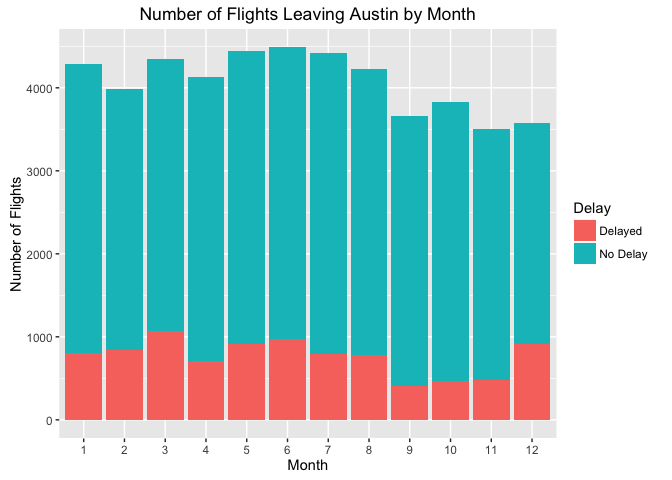
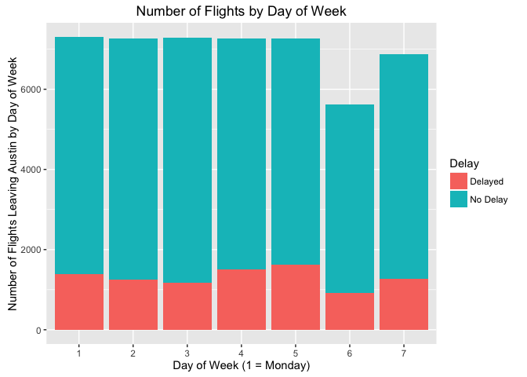
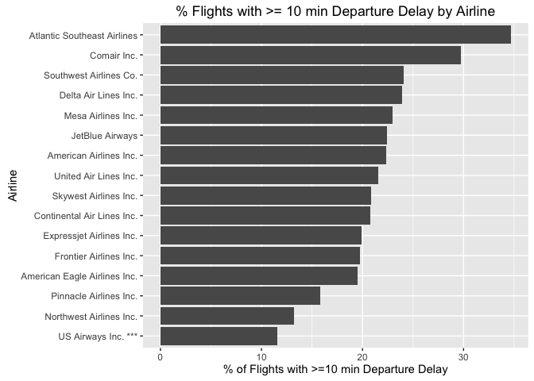

Flights at ABIA
===============

There comes a time in a person's life when he or she has to travel to a
place that is too far to reach by car, and has no choice but to resort
to air travel. Unfortunately, air travel comes with a litany of issues,
some of which include overpriced food, long security lines and crying
babies. Among all of the possible issues associated with air travel, a
delayed flight may be the most frustrating for customers. Fortunately,
by using flight data from all flights that either landed at or departed
from Austin-Bergstrom International Airport (APIA), we could pick
flights that have the least probability of getting delayed.

This analysis will address the following three questions that relate to
choosing flights that have the least likelihood of getting delayed:

-   What are the best times of the year and week to book air travel?
-   Which airlines have the most delays?
-   How does your destination impact the answers to the first 2
    questions?

Finally, the analysis will consider any departure delay greater than 10
minutes to be a delayed flight regardless of what percentile this number
may be bucketed to. Even if 10 minutes is considered below average for a
flight during the Christmas season, a delay of 10 minutes is still
infuriating for the customer.

### Best Times to Travel (on Average)

To begin, let's understand the general trends of delayed flights. The
chart below shows how the time of year impacts the number of delayed
flights.

According to both of these charts, the month and day with the lowest
percentage of delayed flights is October and Saturday, respectively.
However, these percentages aggregate all destinations and airlines
together.

### Airlines to Avoid

Next, let's look at which airlines have the highest percentage of
delayed flights.

\*\*\*US Airways data only available from
January-September 2008. October-December data is combined with American
Airlines due to a merger.

The two worst airlines are Atlantic Southeast Airlines and Comair. In
addition to those two, the percentage of flights with departure delays
in 2008 from seven different airlines exceeded 20%.

However, airlines don't have flights to every city and may specialize in
certain regions. For example, in 2008, Southwest Airlines did not have
any flights to New York City from Austin. If there are multiple airlines
that fly to a city, how can a customer know which airline to take? And
if that city has multiple airports, which airport should he or she
choose?

### Tale of Cities with Two Airports: Choosing the Best Airlines and Months to Travel

Suppose Mary wants to plan a trip to cities with 2 airports from Austin
and is looking to minimize the chance of getting a delay. The cities she
chose are New York City, Dallas, and Chicago. She has three questions:

-   For what months should Mary book her flights?
-   For each city, which airport should she fly to ?
-   Which airlines should she choose?

Charts of % departure delays by month and airline for each city she
plans to visit are shown below.

<h5>
% Flights to NYC with &gt;10 min Departure Delay by Airline
</h5>

<h5>
% Flights to DAL with &gt;10 min Departure Delay by Airline
</h5>

<h5>
% Flights to Chicago with &gt;10 min Departure Delay by Airline
</h5>

According to these 3 groups of charts, September and October appear to
be the best times to fly, which is consistent with what the very first
chart of this analysis showed. However, the best airlines for each city
vary. Below is a sample itinerary that Mary could use:

<table>
<caption>Sample Itinerary</caption>
<thead>
<tr class="header">
<th align="left"></th>
<th align="left">Airline and Airport</th>
<th align="left">Month</th>
<th align="left">Day of Week</th>
</tr>
</thead>
<tbody>
<tr class="odd">
<td align="left">New York City</td>
<td align="left">JetBlue Airways JFK</td>
<td align="left">October</td>
<td align="left">Wednesday</td>
</tr>
<tr class="even">
<td align="left">Dallas</td>
<td align="left">American Airlines DFW</td>
<td align="left">November</td>
<td align="left">Tuesday</td>
</tr>
<tr class="odd">
<td align="left">Chicago</td>
<td align="left">Southwest Airlines MDW</td>
<td align="left">September</td>
<td align="left">Wednesday</td>
</tr>
</tbody>
</table>

Segmenting data to match the scope of the problem is extremely
important. In this case, the problem is figuring out which airlines to
take to cities that have 2 airports. For example, although Southwest
Airlines had the second-highest percentage of delayed flights when
including all of its destinations, its flights to Midway Airport in
Chicago are relatively punctual between June and September. However,
because this analysis only contains data fron 2008, one-off events such
as storms or emergencies may skew the data. Regardless of this
limitation, the general trends seem to be consistent: flights during the
holidays experience the most delays, and flights during the middle of
the week have the least delays. Beyond this, generalizations are
slightly harder to make.
